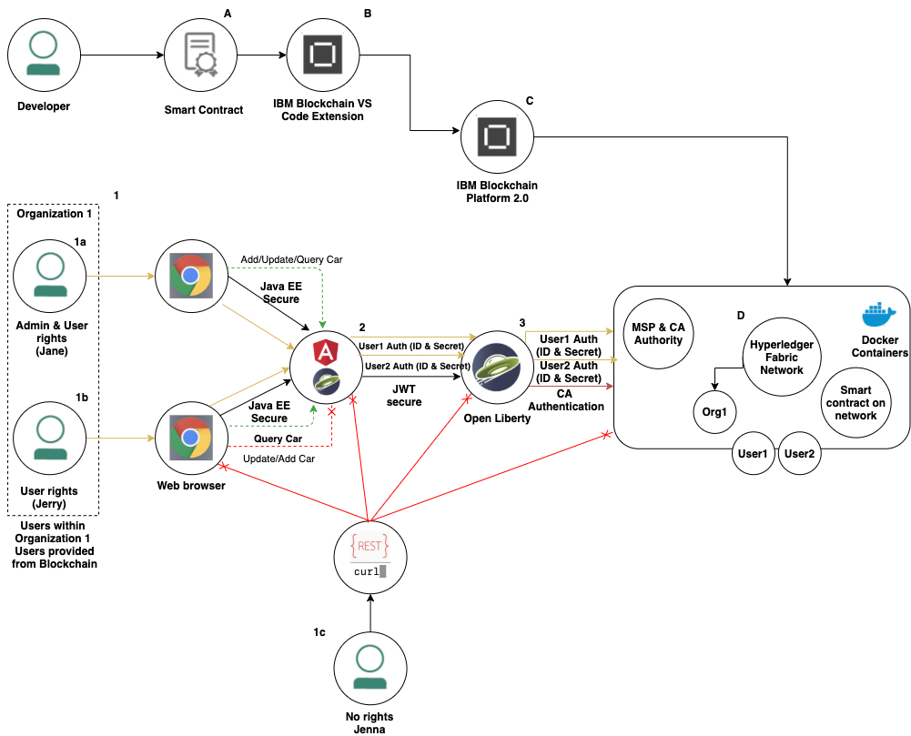
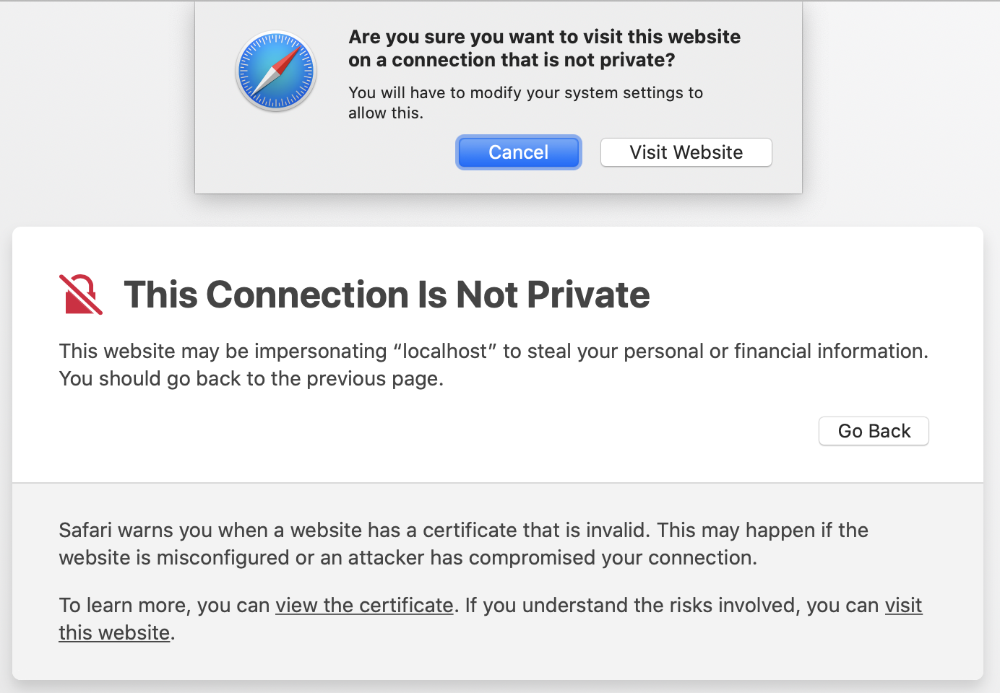
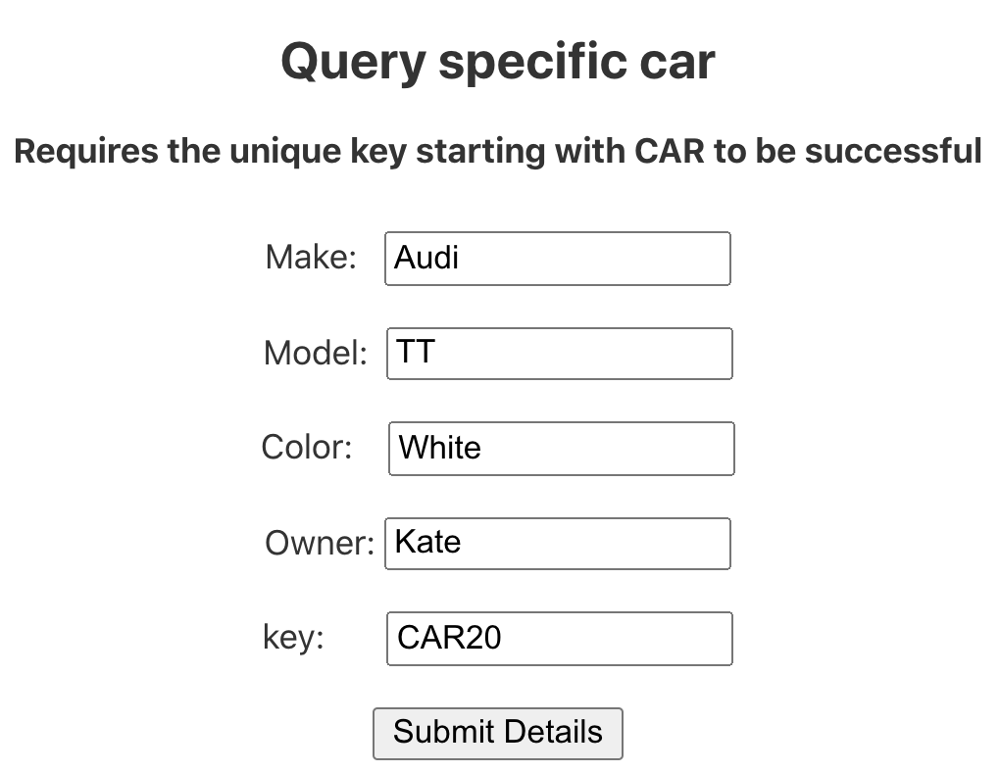

<!-- 
Author: Thomas Jennings
email: thomas.jennings@ibm.com
 -->
# Secure blockchain transactions with Java microservices  

> 1 Org Hyperledger Fabric sample using secure Open Liberty microservices to execute transactions to the blockchain network using MicroProfile JWT and Hyperledger Fabric Attribute-Based Access Control (ABAC).

In this tutorial, use secure Java microservices to execute transactions to a 1 Org blockchain network over HTTPS, using authentication and authorization onto the blockchain network using Json Web Tokens (JWT) and adding identities to the blockchain network, so individual users can interact with blockchain ledger through a secure angular front end UI and back end service, both powered by Open Liberty. 

Learn about the fundamentals of blockchain and Open Liberty by following the [Integrating Java microservices with blockchain using Hyperledger Fabric and Open Liberty](https://developer.ibm.com/tutorials/integrate-java-microservices-with-blockchain-using-hyperledger-fabric-and-open-liberty/) to experience starting a 1 Org blockchain network and using Open Liberty to execute transactions to blockchain. 

Develop blockchain and Open Liberty skills further and learn about distributed blockchain networks with a buyer and seller scenario and [Listen to events from a distributed blockchain network](https://developer.ibm.com/tutorials/listen-to-events-from-a-distributed-blockchain-network/) 


* Use the IBM Blockchain Platform extension to create a 1 Org local blockchain network and deploy a sample smart contract called "fabcar"
* Use the [Open Liberty](https://openliberty.io) development tools to start the secure front-end and back-end Java microservices 
* Authenticate as an admin user to transact to the blockchain network to add query and update cars.
* Add an identity to the blockchain network
* Authenticate as an employee, giving access to certain transaction  functionalities on the network such as querying all ledger state and specific cars.
* Attempt to access front end and backend services to gain access to transact with the blockchain network.


## Architecture flow

 
 
A. The developer develops a smart contract using Java (Preconfigured "fabcar" sample)
 
B. Use the IBM Blockchain Platform Extension for VS Code to package the  "fabcar" smart contract.

C. Setup and launch the IBM Blockchain Platform 2.0 service

D. The IBM Blockchain Platform 2.0 enables the creation of a network in Docker containers locally enabling installation and instantiation of the "fabcar" smart contract on the network

1. Organization One sets access rights within their org for their employees to do the functionalities onto the blockchain network assigned by the smart contract from blockchain network. Our example is 'Fab Car'.

1a. Jane is authenticated and has access rights of type 'Admin' and 'User' allowing her all functionallity to the blockchain network: Adding, Updating, Querying 

1b. Jerry is also authenticated, however as Jerry is a new employee and only has 'User' rights, he is not allowed to add or update cars on the ledger

1c. Jenna is a hacker has no rights and shouldn't be accessing the blockchain network.  

2. Users of Organization One are authenticated for an application sat in front of the Open Liberty-Blockchain RESTful Webservice. This is achieved using Java EE security. This front end application is authenticated to The back end REST API with JSON Web Tokens (JWT).

The back end is authenticated to the Blockchain network through the MSP and the certificates. 

Within the application the microservices are secured with JSON Web Tokens (JWT) which controls the user access with MicroProfile JWT

3. Organisation 1, the seller, performs functionalities  to the ledger using the Open Liberty RESTful Webservice and the Java Fabric SDK.

## Prerequisites:

* Java
* Git
* Maven
* Docker
* VS Code
* Linux or Mac OS

## What is the difference between Authentication and Authorization?

Authentication is the process of verifying who a user is, while authorization is the process of verifying what they have access to.

In this scenario, Open Liberty is managing the authentication of users and IBM Blockchain platform is managing the authorization to communicate to the blockchain network.

## What is MicroProfile Json Web  Tokens?

A MicroProfile JSON Web Token uses a token-based authentication mechanism to authenticate, authorize, and verify user identities based on a security token. It is a way for security controls and security tokens to propagate user identities across different services. 

In this case, the services are the Angular UI and the backend REST service to transact with the blockchain network.  

<!--
## What is Hyperledger attribute based access control?

Attribute based access control (ABAC) restricts access for a specific user, allowing a certain user to have only the necessary attributes in their certificate to transact with the blockchain network. 

### Why do you need JWT and ABAC?

JWT security is for securing the Java Microservices and ABAC is for securing blockchain.

If ABAC was not implemented, Open Liberty would use only one certificate, the admin CA. In previous tutorials, we only use the admin CA. 
-->
## Steps

* Import the Open Liberty projects into VS Code.

* Import the FabCar sample smart contract project into VS Code.

* Start a 1 Org blockchain network and deploy the contract. 

* Export the admin credential for Org1 Admin user to communicate with the blockchain network.

* Startup Angular front-end  microservice.

* Startup the back-end microservice.

* Login as an admin user to execute transactions over HTTPS. 

* Add an employee identity to the wallet through the VS Code extension 

* Login as an employee to execute transactions over HTTPS.

* Login as a user with no access rights to the blockchain network.

* Attempt to login as a user with no authorization.

* Attempt to access the back-end service to transact directly to the blockchain network without the frontend.

* Stop the microservices.

* Stop the Blockchain Network.

* Conclusion

## 1. Get the development tools

1. If you have not already, download and [Install version 1.38 Visual Studio Code.]((https://code.visualstudio.com/download) )

1.  Install the [IBM Blockchain Platform extension for VS Code.](https://marketplace.visualstudio.com/items?itemName=IBMBlockchain.ibm-blockchain-platform)

    After installation, if any additional prerequisites are needed, the extension will guide you through installing them. Make sure you pick up the Docker prerequisites, as they will be used to create your Fabric network.

1. Install the [Open Liberty Tools for VS Code.](https://marketplace.visualstudio.com/items?itemName=Open-Liberty.liberty-dev-vscode-ext)

## 2. Import the Open Liberty projects into VS Code

1. Open a terminal window and clone the sample project in GitHub:

    `git clone https://github.com/tomjenningss/security-openliberty-blockchain.git`

To add Org1-Functions project to VS Code, select **File > Open > security-openliberty-blockchain/microservices/org1-microservice/org1-OL-Blockchain-Functions**, and then click Open.

This adds the Org1 project to the workspace and automatically adds Liberty Dev Dashboard into the VS Code extension. To display org1-ol-blockchain-functions, you can click Liberty Dev Dashboard.

Select **File > New Window** to open a new VS Code window to add the Client  project.

To import the client project, select **File > Open > security-openliberty-blockchain/application/client/org1-client**, and then click Open.

## 3. Import the FabCar sample smart contract project into VS Code

1. Click the IBM Blockchain Platform icon in the top right corner (looks like a square).

   

    It may take a moment. In the purple bar at the bottom, it will say, "Activating extension."

1. Select **FabCar** from the "Other "Resources" section.

1. Click the **Clone** button to git clone the sample code for the FabCar sample, and choose a convenient location to clone the fabric sample.

1. Select **Clone**. 

   

1.  From the list of options choose, **FabCar v1.0.0 Java**.

1. Click **Open Locally**.

   

1. In the Command Palette, click **Add to workspace**.

1. *Optional*: Click the **File explorer** button in the top left, and you will see `fabcar-contract-java`, which is the smart contract project.

1. Click the IBM Blockchain Platform icon on the left side to navigate back to the IBM Blockchain Platform extension for VS Code.

## 4. Start a 1 Org blockchain network and deploy the contract

1. Under FABRIC ENVIRONMENTS, select 1 Org Local Fabric o (click to start).

    This will start up Docker containers and configure the startup of the blockchain network. The first time will take approximately 3 – 5 minutes, as it pulls down the Docker images, starts up the containers, and configures the blockchain network.

1. Once you’re connected to the “Local Fabric” environment (this happens automatically after it has started), under Smart Contracts > Instantiated, click +Instantiate.

1. Choose fabcar-contract-java Open Project (at the Command Palette prompt).

1. When prompted to “Enter a name for your Java Package,” enter fabcar, and press Enter.

1. When prompted to “Enter a version for your Java package,” enter 1.0.0.

1. When “Optional functions” appears, enter initLedger. This initializes the ledger with cars. Not entering the function will result in the blockchain network being empty.

## 5. Export credentials to communicate with the blockchain network

For Open Liberty to communicate to the blockchain network, Hyperledger Fabric has security features that stop applications attempting to make transactions unless you have the specific profiles and certificate authorities. 

1. Export the Local Fabric Gateways:

   1. In the “FABRIC GATEWAYS” panel, select 1 Org Local Fabric – Org1.

        “Choose an identity to connect with” will appear from the command palette. Select admin.

   1. Select `Org1` and "Choose an identity to connect with" will appear from the command palette. Select **admin**.

      

   1. Hover over the **FABRIC GATEWAYS** heading, click **...** > **Export connection profile**.

      

   1. The `finder` window will open.

   1. Navigate to `Users/Shared/`.

   1. Create a new folder `FabConnection`.

      The full path directory should be `Users/Shared/FabConnection`.

   1. Save the `.json` file as `1-Org-Local-Fabric-Org1_connection.json`.

   1. To disconnect from Org1 Fabric gateway press the "door" icon. 
   
    
 

## 6. Start Client App and Org 1 Microservice

1. You will have two VS Code widows open. As we installed the Dev Tool for Open Liberty, click the Liberty Dev Dashboard icon, and the extension will display the project: `org-1-ol-blockchain`.

1. Right-click org1-ol-blockchain, and select Start.

    This will quickly start up the microservice within 2 – 5 seconds.

    Org1 is now running on port 9445.

1. Navigate to the other VS Code window, click the Liberty Dev Dashboard icon, and the extension will display the project: `org-1-ol-client`.

    Right-click org1-ol-client, and select Start.

    client is now running on port 9445.

## 7. Login as Admin 

Open up the web browser of choice. (Safari is the easiest to accept the SSL)

Navigate to `https://localhost:9443/home/`

The browser will give you a certificate warning, this is because the Open Liberty server created a self-signed (SSL) certificate by default. 

Follow your browser’s provided instructions to accept the certificate and continue. 



First, click 'show details' and a text box below 'This Connection Is Not Private' will appear. Select 'visit this website' link and When prompted click: 'Visit Website'. This will prompt you for a password; enter the login password that you use when first starting up the machine.

Notice the 'padlock' and 'https' is the URL bar.

The login page will appear. Login as 'Bob' who is an admin user.

Username: `bob`

Password: `bobpwd`

Click the `login` button

This will take you to the main landing page where company employees can interact with the blockchain network. 

## 8. Add a car to the ledger

The admin user may be interested in adding a car to the ledger. This may happen if a new list of cars has arrived into the garage.



Fill in the UI with the following example

`Audi`

`TT`

`White`

`Kate`

`CAR20`

Press submit details to make a secure transaction to the blockchain network

Navigate back to the landing page by clicking the 'Home' button in the bottom left hand corner and logout by clicking the 'logout' button at the top right of the page.
 
## 9. Query all ledger state as a regular employee

An employee may be interested in querying all the cars to see what is on the ledger so far.

Select `Query all cars > ` button. As no user interaction is needed, the cars from the blockchain ledger will automatically appear.

This will send a request to the Ledger and return all the cars. A successful response should look like:

```
Query All Cars on the network:
Owner:	Color:	Model:	Make:
Tomoko	blue	Prius	Toyota
Brad	red	Mustang	Ford
Jin Soo	green	Tucson	Hyundai
Max	yellow	Passat	Volkswagen
Adrian	black	S	Tesla
Michel	purple	205	Peugeot
Aarav	white	S22L	Chery
Pari	violet	Punto	Fiat
Valeria	indigo	nano	Tata
Shotaro	brown	Barina	Holden
```
From clicking the `Query all cars` button, a request is  made to the backend rest-server, securely over HTTPS. From there the server contacts the blockchain network to retrieve all the cars, return it to the back-end server and the back end sends it to the client user interface. 

If you tried to add a car it will not allow you as the JWT authorization is specifying that the only users that are allowed to add cars to the ledger are 'admin' users.

<!--
## 11. Query a specific car on the ledger

As the blockchain is distributed you can query the specific car from any organization. However as the buyer has agreed to buy the car query it from Org2:

`http://localhost:9081/openapi/ui/`

As well as a unique transaction id there is a unique key for every car. The difference between a transaction id and the key is every time a transaction is made, even with the same key, the transaction id changes. They key does not.

1. In the OpenAPI UI, select **GET /System/Resources/Car Returns an individual car by key.**

1. Re-query CAR23 to see the updated owner.


Query the recently added car by inserting the ID and clicking Execute.

The successful response should look like:

```
   Queried car Successfully.
   Key = CAR23
   Details = {"make":"Ford","model":"Fiesta","colour":"Blue","owner":"Yasmin A"}
```
-->


## 12. Stop the Open Liberty microservices

<!--
Once you have finished, for both organsiations go to VS Code > Liberty Dev Dashboard, and press **Stop**. This will stop the Open Liberty server. 

Now, the servers is off and the application is not running anymore. If you tried to hit one of the endpoints, it would not find it.
-->

## 13. Tear down the blockchain network

<!--
*Optional*: You can stop the blockchain network, and save the state on the ledger if you decide to come back to it later. Click on the IBM Blockchain Platform icon on the left side. On Fabric Environments, click **...** > **Stop Fabric Environment**. 

1. You can easily start it again by clicking `2 Org Local Fabric`. 

To remove the Docker images where it is running, on Fabric Environments click **...** > **Teardown Fabric Environment**.

-->

## Conclusion

<!--
Well done. You have created a 2 Org network, where different organizations submit transactions to the blockchain: adding, updating and querying as well as listening to events from a blockchain using the Hyperledger Java SDK and Open Liberty.
-->